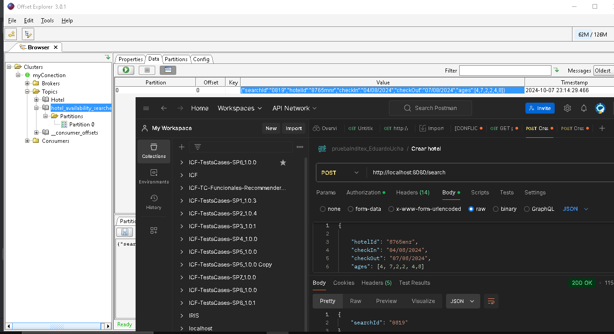
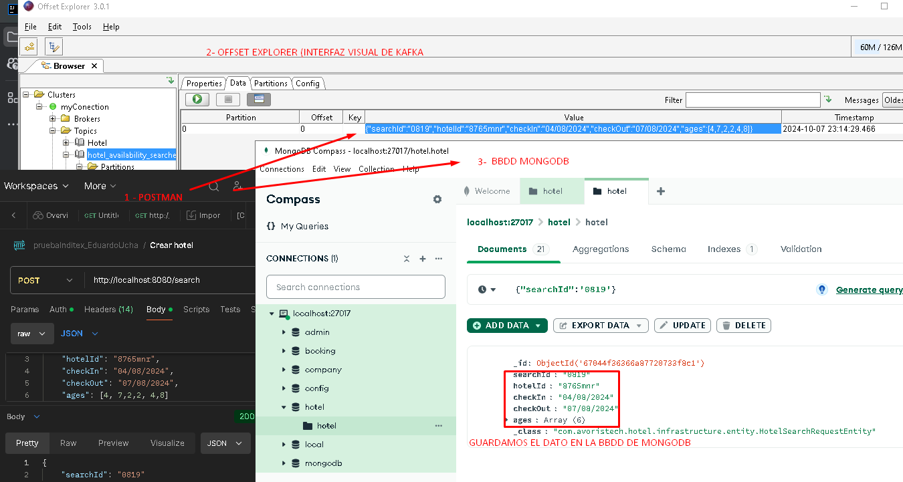

# Prueba Técnica Avoristech
Inc
**Ramón Arcís Burgos**
**dni: 20826736Y**
**email: ramonarcis@hotmail.com**

Este es el proyecto realizado para la prueba de Avoristech

Desarrollo de aplicación con Spring Boot, con Java v.21 y
Apache maven 3.6.3.

La aplicación debe proveer de dos llamadas REST:

-Llamada POST al path /search
-Llamada GET al path /count con un único parámetro llamado
searchId

Hemos agregado un consumidor del topic de Kafka
hotel_availability_searches dónde recoja los mensajes y los persista.

La presistencia esta con una base de datos de MONGO.
spring.data.mongodb.uri=mongodb://localhost:27017/hotel

Pasos previos para probar en local

Pasos vamos al shell de Win (cmd) en modo admin,Kafka y lanzamos en dos ventanas:
1- Accedmos a la ruta de donde tenemos kafka (C:\kafka\kafka_2.13-3.8.0) y lanzamos este comando.
bin\windows\zookeeper-server-start.bat .\config\zookeeper.properties

2- Accedmos a la ruta de donde tenemos kafka (C:\kafka\kafka_2.13-3.8.0) y lanzamos este comando.
bin\windows\kafka-server-start.bat .\config\server.properties

3- Arrancamos  el servidor en el intell ij Idea, y luego programa. Y lanzamos un Post desde postamn.
Abrimos el Offset explorer, donde vemos los mensajes.

Podemos ver como lanzamos un POST, y vemos con el Offset Explorer el resultado del mensaje kafka
imagen: 

Pasos para arrancar la BBDD de MONGODB, desde el shell de Win (cmd)
1- Arrancamos el servidor de mongo.
mongod

2- Arrancamos el shell de mongoDB, aqui podemos crear la bbdd, y sus colecciones.
mongosh

3- Abrimos el mongodb Compass (interfaz de MONGODB), donde vemos las colecciones.

imagen POST, con las herramientas POSTMAN, OFFSET EXPLORER (colas kafka), MONGODB COMPASS BBDD.

Postman:

1- Creamos una reserva - Curl POST 
curl --location 'http://localhost:8080/search' \
--header 'x-app-token: {{icf-token-i}}' \
--header 'token: {{icf-token-i}}' \
--header 'cha: WebApp' \
--header 'validar: 1' \
--header 'Content-Type: application/json' \
--header 'Authorization: Bearer {{icf-token}}' \
--data '{

    "hotelId": "8765mnr",
    "checkIn": "04/08/2024",
    "checkOut": "07/08/2024",
    "ages": [4, 7,2,2, 4,8]

}
'

2- Obtenemos la reserva con el count - Curl GET
curl --location 'http://localhost:8080/count?searchId=9468' \
--header 'accept: application/json'

